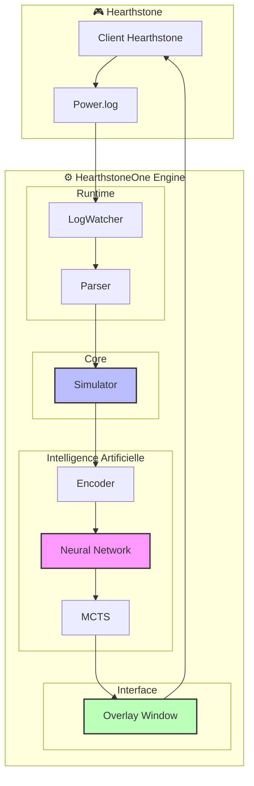
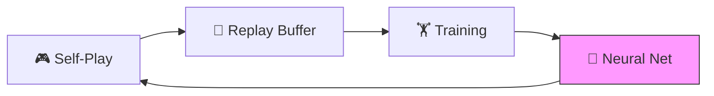
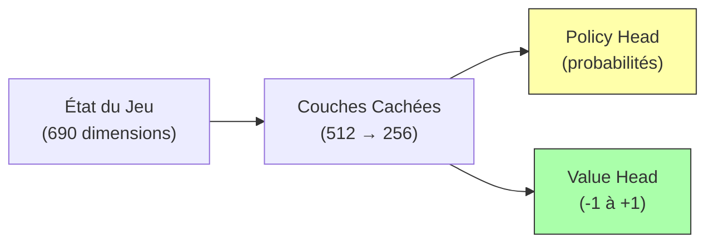
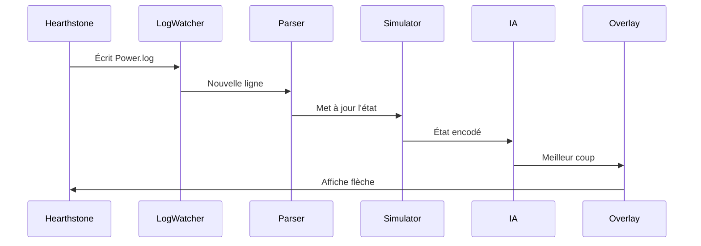

# 🃏 HearthstoneOne

> **Assistant IA pour Hearthstone** — Coaching en temps réel + Entraînement AlphaZero


---

## ✨ Qu'est-ce que HearthstoneOne ?

HearthstoneOne est un écosystème complet d'Intelligence Artificielle pour Hearthstone :

- 🧠 **IA AlphaZero** — Apprend à jouer de zéro via self-play (MCTS + Deep Learning)
- 👁️ **Overlay Temps Réel** — Affiche les meilleurs coups par-dessus le jeu
- � **Simulateur Universel** — Supporte toutes les cartes modernes (généré par LLM)
- 📊 **Analyse de Parties** — Parse les logs Hearthstone en direct

---

## 🏗️ Architecture



---

## 🧠 AlphaZero : Le Cerveau

L'IA utilise l'algorithme **AlphaZero** de DeepMind, adapté à Hearthstone.

### Cycle d'Apprentissage



| Composant | Description |
|-----------|-------------|
| **Self-Play** | L'IA joue contre elle-même pour générer des données |
| **Replay Buffer** | Stocke les trajectoires (état, action, résultat) |
| **Training** | Entraîne le réseau sur les données collectées |
| **Neural Net** | Prédit la politique (meilleur coup) et la valeur (qui gagne) |

### Réseau de Neurones



---

## 👁️ Live Assistant

L'overlay affiche les suggestions en temps réel par-dessus Hearthstone.

### Pipeline de Données



### Fonctionnalités

| Suggestion | Visuel |
|------------|--------|
| Jouer une carte (avec cible) | 🟢 Flèche verte |
| Jouer une carte (sans cible) | 🟡 Cercle doré |
| Attaquer (créature → cible) | 🟢 Flèche verte |
| Pouvoir Héroïque | ⏳ À venir |
| Activer un Lieu | ⏳ À venir |

---

## 🚀 Installation

### Prérequis

- Python 3.10+
- Hearthstone installé
- CUDA (optionnel, pour GPU)

### Étapes

```bash
# 1. Cloner
git clone https://github.com/Kevzi/-HearthstoneOne.git
cd HearthstoneOne

# 2. Installer les dépendances
pip install -r requirements.txt

# 3. Configurer les logs Hearthstone
# Créer le fichier : C:\Users\VOUS\AppData\Local\Blizzard\Hearthstone\log.config
# Contenu :
# [Power]
# LogLevel=1
# FilePrinting=true
# ConsolePrinting=true
# ScreenPrinting=false
```

---

## 📖 Utilisation

### Lancer l'Assistant Live

```bash
python runtime/live_assistant.py
```

Puis lancez Hearthstone et commencez une partie. L'overlay apparaîtra automatiquement.

### Entraîner l'IA

```bash
python training/trainer.py
```

### Évaluer le Modèle

```bash
python evaluation.py
```

---

## 📂 Structure du Projet

```
HearthstoneOne/
├── ai/                    # 🧠 Intelligence Artificielle
│   ├── model.py           #    Réseau de neurones
│   ├── mcts.py            #    Monte Carlo Tree Search
│   ├── encoder.py         #    Encodage état → tenseur
│   └── replay_buffer.py   #    Stockage trajectoires
│
├── simulator/             # 🎮 Moteur de Jeu
│   ├── game.py            #    Logique de partie
│   ├── player.py          #    Gestion joueur
│   ├── entities.py        #    Cartes, Serviteurs, Héros
│   └── factory.py         #    Création dynamique
│
├── runtime/               # 👁️ Interface Temps Réel
│   ├── live_assistant.py  #    Orchestrateur principal
│   ├── log_watcher.py     #    Surveillance Power.log
│   └── parser.py          #    Décodage des logs
│
├── overlay/               # 🖥️ Interface Graphique
│   ├── overlay_window.py  #    Fenêtre transparente
│   └── geometry.py        #    Calcul positions écran
│
├── training/              # 🏋️ Entraînement
│   ├── trainer.py         #    Boucle d'entraînement
│   └── data_collector.py  #    Collecte self-play
│
└── docs/                  # 📚 Documentation
    └── TASKS.md           #    Feuille de route
```

---

## �️ Technologies

| Catégorie | Technologie | Usage |
|-----------|-------------|-------|
| **Core** | Python 3.10+ | Langage principal |
| **ML** | PyTorch 2.0+ | Réseaux de neurones |
| **GUI** | PyQt6 | Overlay transparent |
| **Data** | hearthstone_data | Base de données cartes |

---

## 🗺️ Roadmap

- [x] Simulateur de base
- [x] Parser de logs
- [x] Overlay graphique
- [x] Suggestions de cartes
- [x] Suggestions d'attaques
- [x] Pouvoir Héroïque (24 pouvoirs: basic + upgraded + hero cards)
- [x] Lieux (Locations)
- [x] Intégration IA entraînée (MCTS + Neural Network)
- [x] Secrets (12 secrets: Mage, Hunter, Paladin, Rogue)
- [x] 404+ effets de cartes (Classic → Scholomance)
- [ ] Multi-suggestions (plusieurs flèches)

---

## 📜 Licence

MIT License — Voir [LICENSE](LICENSE)

---

<p align="center">
  <b>HearthstoneOne</b> — Projet open-source pour la recherche et l'éducation.
</p>
